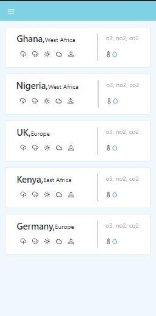

# Weather app
> A simple weather app that displays realtime weather data for cities around the world.

Additional description about the project and its features.

## Built With

- React
- Redux
- Open Weather API

## Live Demo

[Site is live. Visit now!](https://weatherer01.netlify.app)

## Getting Started

To get a local copy up and running follow these simple example steps.

### Prerequisites

- Knowledge on basic html and css
- Text Editor (VScode, Atom, Sublime text, etc)
- Basic knowledge of node.js

### Setup

- clone repository using `git clone`
- git clone `https://github.com/Amedzro-Elikplim/React-Capstone-Project`
- cd `React-Capstone-Project`.
- run `npm install`
- run `npm run start` to start webpack dev server

## Author
👤 **Amedzro Elikplim Emmanuel**

- GitHub: [@Amedzro-Elikplim](https://github.com/Amedzro-Elikplim)
- Twitter: [@ElikplimAmedzro](https://twitter.com/Amedzro-Elikplim)
- LinkedIn: [Emmanuel Elikplim Amedzro](https://www.linkedin.com/in/emmanuel-elikplim-amedzro-187590125/)

## 🤝 Contributing

Contributions, issues, and feature requests are welcome!

Feel free to check the [issues page](../../issues/).

## Show your support

Give a ⭐️ if you like this project!

## 📝 License

This project is [MIT](./LICENSE) licensed.